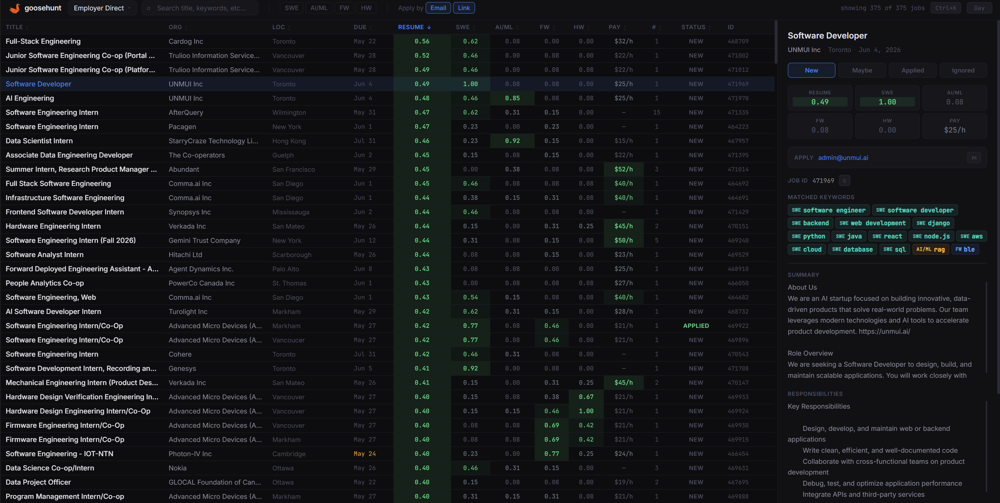
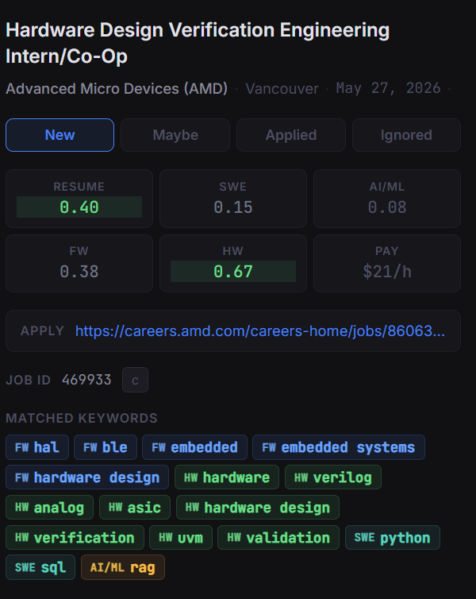
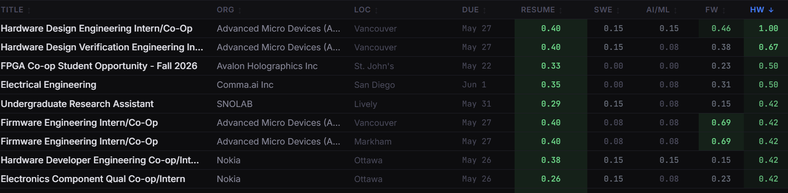
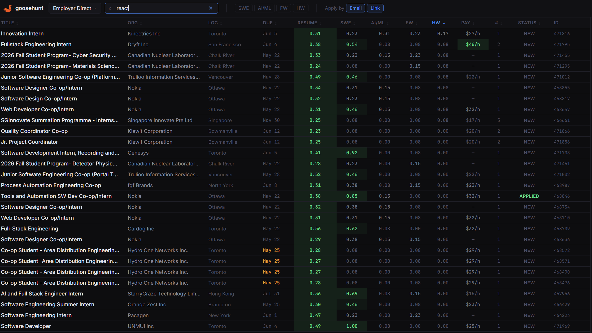
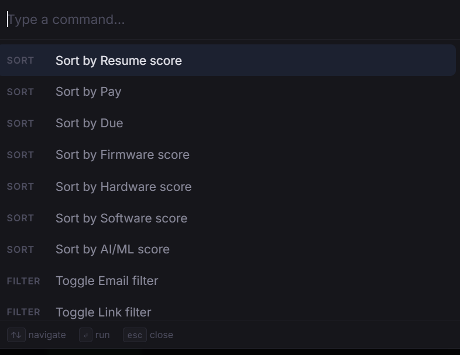

<p align="center">
  
</p>

# goosehunt

A personal tool for UWaterloo co-op students that turns the WaterlooWorks Employer Direct board into a ranked, filterable local UI — scored against your resume and classified by role.

> **Personal use only.** WaterlooWorks ToS likely prohibits automated scraping. Use at your own risk.

---

## What it does

1. **Scrapes** your currently visible Employer Direct results using Playwright. You log in manually, set your filters and work term in WaterlooWorks, then press Enter — the scraper does the rest.
2. **Stores** every posting in a local SQLite database. Resumable: a crashed scrape picks up where it left off.
3. **Classifies** each posting against four role types (SWE, AI/ML, firmware, hardware) using tunable keyword lists in `config/roles.yaml`.
4. **Scores** each posting against your resume PDF using cosine similarity on sentence embeddings.
5. **Serves** a local web UI — one page, all postings loaded, client-side sort/filter, keyboard navigation, no build step.

---

## Requirements

- [uv](https://docs.astral.sh/uv/getting-started/installation/) — Python package manager
- A UWaterloo WaterlooWorks account with active co-op access
- Your resume as `resume.pdf`

---

## Setup

```bash
make install
cp /path/to/resume.pdf resume.pdf
```

`make install` creates a venv, installs dependencies, and downloads the Chromium browser for Playwright.

---

## First run

```bash
make run
```

This opens a Chromium window. Log in to WaterlooWorks (Duo if prompted), navigate to the Employer Direct board, set your work term and filters, wait for job listings to appear, then press Enter in the terminal. The scraper runs, the pipeline processes everything, and the UI starts at `http://localhost:8000`.

On subsequent runs where you just want to re-serve existing data:

```bash
make serve
```

To re-scrape and reprocess without restarting the server:

```bash
make scrape && make pipeline
```

---

## Docker (any device, no Python setup)

Scraping must still run locally (it needs your WaterlooWorks session). Everything after that runs in the container.

```bash
# scrape locally first
make scrape

# on any device with Docker — copy the repo + data/postings.jsonl + resume.pdf, then:
docker compose up
```

`docker compose up` runs ingest → embed → score → serve on every start, then keeps the UI alive at `http://localhost:8000`. The HuggingFace model is cached in a named volume so it's only downloaded once.

---

## Makefile targets

```
make install     # create venv, install deps, install Chromium
make run         # scrape + pipeline + serve (full end-to-end)
make scrape      # scrape only → data/postings.jsonl
make pipeline    # ingest → embed → score (run after scrape)
make serve       # start FastAPI on localhost:8000
make test        # run unit tests (no browser required)
make scrape-diag # fetch one posting, dump raw HTML + parsed fields to data/diag.md
```

Individual pipeline steps: `make ingest`, `make embed`, `make score`.

---

## UI

Two-pane layout: sortable table on the left, posting detail panel on the right.

**Full UI — sortable table with resume, role, and pay scores across all postings**


**Detail panel — score grid, matched keywords per role, and apply link for a selected posting**


**Sort by any score — here sorted by hardware relevance**


**Search — instant client-side filter across title, org, summary, and skills**


**Command palette (Ctrl+K) — keyboard-driven access to all sort and filter actions**


**Filters:** search box, role chips (`SWE`, `AI/ML`, `FW`, `HW`), apply-by chips (`Email`, `Link`).

**Table columns:** title, org, location, deadline, resume score, role scores, pay, openings, status. All sortable. Click a job ID to copy it.

**Detail panel:** score grid, apply link/email with copy buttons, keyword-hit chips showing which keywords fired per role, summary/responsibilities/required skills, and local status buttons (`New` / `Maybe` / `Applied` / `Ignored`).

**Keyboard shortcuts:**

| Key        | Action               |
|------------|----------------------|
| `j` / `k`  | Navigate rows        |
| `/`        | Focus search         |
| `Esc`      | Blur search          |
| `c`        | Copy job ID          |
| `m`        | Copy apply email     |
| `Shift+S`  | Sort by resume score |
| `Shift+P`  | Sort by pay          |
| `Ctrl+K`   | Command palette      |

A Day/Night toggle persists the theme in `localStorage`.

---

## Scores

| Score            | What it measures                              |
|------------------|-----------------------------------------------|
| `score_software` | SWE keyword match                             |
| `score_ai_ml`    | AI / ML / data science keyword match          |
| `score_firmware` | Firmware / embedded / mechatronics keyword match |
| `score_hardware` | Hardware / FPGA / PCB keyword match           |
| `score_resume`   | Cosine similarity between posting and your resume |
| `comp_score`     | Estimated hourly pay, normalized to [0, 1] ($16/hr → 0.0, $60/hr → 1.0) |

All scores are in [0, 1]. Keywords are tunable — edit `config/roles.yaml` and rerun `make score`.

---

## Refreshing postings

`make scrape` is resumable and skips job IDs already in `data/postings.jsonl`. To force a full refresh after changing the scraper or parser:

```bash
mv data/postings.jsonl data/postings.old.jsonl
make scrape
make ingest
.venv/bin/python embed/embed_postings.py --force
make score
```

Local job statuses (`new`/`maybe`/`applied`/`ignored`) are stored in `data/postings.db` and are preserved across re-scrapes.

---

## Project layout

```
goosehunt/
├── config/
│   └── roles.yaml          # keyword lists for each role scorer
├── scraper/
│   ├── scraper.py          # Playwright scraper → JSONL
│   └── test_scraper.py     # unit tests (no browser required)
├── db/
│   ├── schema.sql          # CREATE TABLE statements
│   └── ingest.py           # JSONL → SQLite
├── embed/
│   ├── embed_postings.py   # sentence-transformers → BLOB column
│   └── embed_resume.py     # embed resume PDF → score_resume column
├── classifier/
│   └── scorer.py           # keyword scorer → score_* columns
├── resume/
│   └── parser.py           # pdfplumber PDF → plain text
├── web/
│   ├── main.py             # FastAPI app
│   └── static/
│       └── index.html      # Alpine.js UI, no build step
├── scripts/
│   └── preflight.py        # input validation before pipeline/Docker
├── data/                   # gitignored — created at runtime
│   ├── postings.jsonl
│   └── postings.db
├── resume.pdf              # gitignored — add your own
├── Dockerfile
├── docker-compose.yml
└── Makefile
```

For implementation details and design decisions, see [DESIGN.md](DESIGN.md).

---

## License

[MIT](LICENSE)

---

## Notice

goosehunt is not affiliated with the University of Waterloo, WaterlooWorks, or Orbis. It does not bypass login, Duo, or any WaterlooWorks access controls — the scraper runs through your own browser session after you manually log in.

All scraped data is stored locally. Nothing is sent to a goosehunt server (there isn't one). Users are responsible for complying with WaterlooWorks terms, university policies, and any applicable laws before scraping or storing posting data.

goosehunt is provided as-is, without warranty. Verify important details in WaterlooWorks or with the employer before making application decisions.
