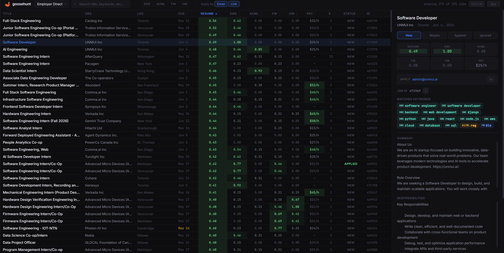
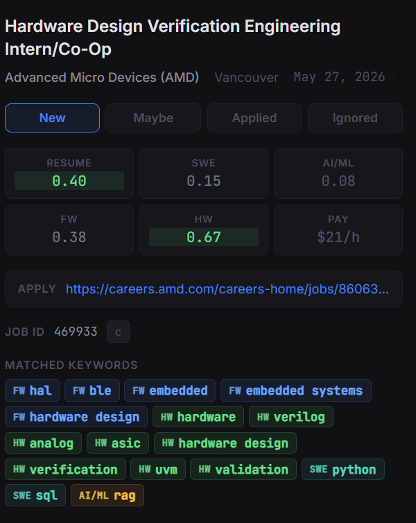
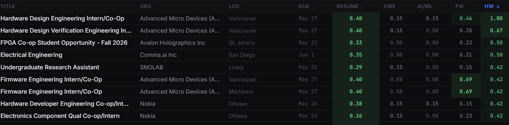
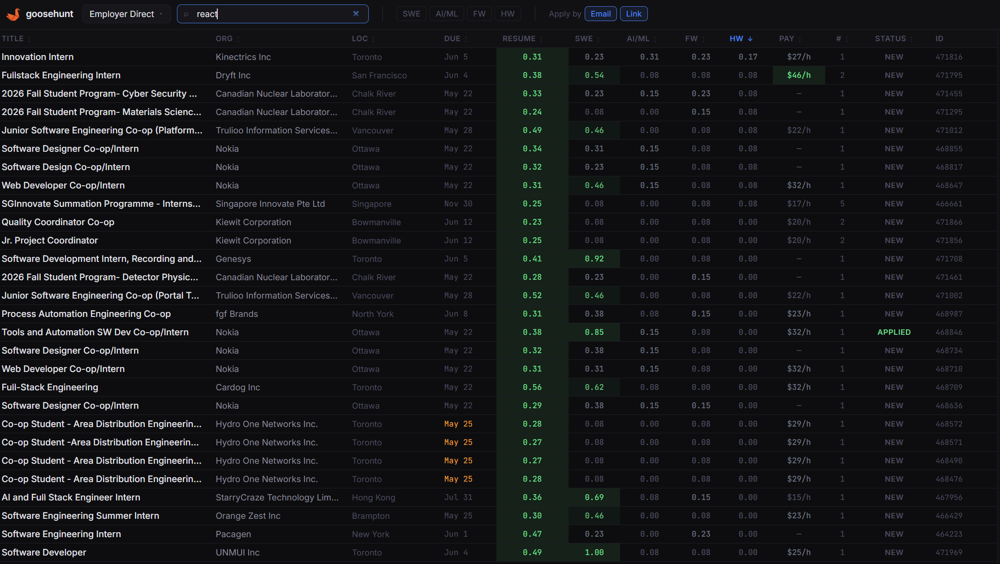
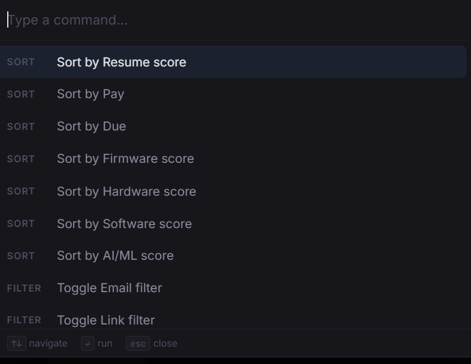

<p align="center">
  
</p>

# goosehunt

A personal tool for UWaterloo co-op students that turns WaterlooWorks job boards (Employer Direct and Full Cycle Service) into a ranked, filterable local UI — scored against your resume and classified by role.

> **Personal use only.** WaterlooWorks ToS likely prohibits automated scraping. Use at your own risk.

---

## What it does

1. **Scrapes** your currently visible WaterlooWorks results using Playwright (Employer Direct or Full Cycle). You log in manually, set your filters and work term, then press Enter — the scraper does the rest.
2. **Stores** every posting in a local SQLite database. Each run re-scrapes everything currently listed so deadlines stay current, and prunes postings that have dropped off the board (`--resume` picks a crashed scrape back up instead).
3. **Classifies** each posting against four role types (SWE, AI/ML, firmware, hardware) using tunable keyword lists in `config/roles.yaml`.
4. **Scores** each posting against your resume PDF using cosine similarity on sentence embeddings.
5. **Serves** a local web UI — one page, all postings loaded, a filter sidebar, client-side sort, text or semantic search, keyboard navigation, no build step.

---

## Requirements

- [uv](https://docs.astral.sh/uv/getting-started/installation/) — Python package manager
- A UWaterloo WaterlooWorks account with active co-op access
- Your resume as `resume.pdf`

---

## Setup

```bash
make install
cp /path/to/resume.pdf resume.pdf
```

`make install` creates a venv, installs dependencies, and downloads the Chromium browser for Playwright.

---

## First run

Put your WaterlooWorks credentials in the git-ignored `.env` file:

```dotenv
WATERLOOWORKS_EMAIL=your_username@uwaterloo.ca
WATERLOOWORKS_PASSWORD=your_password
```

```bash
make run                  # Employer Direct (default)
make run BOARD=full_cycle # Full Cycle Service
```

This opens a Chromium window, fills the UWaterloo ADFS login form from `.env`, and submits it. Complete Duo if prompted. The scraper detects the authenticated dashboard automatically, opens the board selected by `BOARD`, clicks **ALL JOBS**, and runs five concurrent workers against that one authenticated page. No extra tabs or terminal handoff are needed. The pipeline then processes everything, and the UI starts at `http://localhost:8000`.

Credentials are only filled when the browser is on the exact `adfs.uwaterloo.ca` host. The `.env` file is ignored by Git; do not commit it or share it. If either value is absent, the scraper falls back to manual browser login.

On subsequent runs where you just want to re-serve existing data:

```bash
make serve
```

To re-scrape and reprocess without restarting the server:

```bash
make scrape BOARD=full_cycle && make pipeline
```

The scraper also pulls each employer's Work Term Ratings tab (previous Waterloo hires, by work term number and faculty). Add `ARGS=--no-ratings` to skip it, or `ARGS="--probe-ratings 10"` to dump the raw ratings JSON for ten jobs to `data/ratings_sample.json` without scraping.

Set the detail-scraping concurrency with `ARGS="--workers N"`; the default is 5.
Listing pagination remains sequential but has no fixed delay between pages.
If the final listing page contains fewer than the configured page size, its jobs
are processed by one worker after the full pages finish.

---

## Docker (any device, no Python setup)

Scraping must still run locally (it needs your WaterlooWorks session). Everything after that runs in the container.

```bash
# scrape locally first
make scrape

# on any device with Docker — copy the repo + data/postings.jsonl + resume.pdf, then:
docker compose up
```

`docker compose up` runs ingest → embed → score → serve on every start, then keeps the UI alive at `http://localhost:8000`. The HuggingFace model is cached in a named volume so it's only downloaded once.

---

## Makefile targets

```
make install     # create venv, install deps, install Chromium
make run         # scrape + pipeline + serve (BOARD=direct by default)
make scrape      # scrape only with 3 workers → data/postings.jsonl
make pipeline    # ingest → embed → score (run after scrape)
make serve       # start FastAPI on localhost:8000
make test        # run unit tests (no browser required)
```

Set `BOARD=full_cycle` on `make run` or `make scrape` for the Full Cycle board.
Set `ARGS="--workers 1"` to disable parallel detail scraping.

Individual pipeline steps: `make ingest`, `make embed`, `make score`.

---

## UI

Two-pane layout: sortable table on the left, posting detail panel on the right.

**Full UI — sortable table with resume, role, and pay scores across all postings**


**Detail panel — score grid, matched keywords per role, and apply link for a selected posting**


**Sort by any score — here sorted by hardware relevance**


**Search — instant client-side filter across title, org, summary, and skills**


**Command palette (Ctrl+K) — keyboard-driven access to all sort and filter actions**


**Filters:** search box, role chips (`SWE`, `AI/ML`, `FW`, `HW`), apply-by chips (`Email`, `Link`).

**Table columns:** title, org, location, deadline, resume score, role scores, pay, openings, status. All sortable. Click a job ID to copy it.

**Detail panel:** score grid, apply link/email with copy buttons, keyword-hit chips showing which keywords fired per role, summary/responsibilities/required skills, and local status buttons (`New` / `Maybe` / `Applied` / `Ignored`).

**Add applied — bulk-mark everything you've already applied to.** Marking 40+ postings one drawer at a time is tedious, so the topbar has an **Add applied** button. Open WaterlooWorks → `Postings / Applications` → `Applications`, select the whole page (`Ctrl+A`) and copy it (`Ctrl+C`), then paste it into the overlay and press **Mark as applied**. goosehunt reads only the job IDs out of the paste — everything else on the page is ignored — and flips those postings to `Applied`. It is additive and repeatable: postings not in the paste keep their status, and pasting the same page twice changes nothing. Paste one page at a time if your applications list is paginated. `Esc` closes the overlay.

**Keyboard shortcuts:**

| Key        | Action               |
|------------|----------------------|
| `j` / `k`  | Navigate rows        |
| `/`        | Focus search         |
| `Esc`      | Blur search          |
| `c`        | Copy job ID          |
| `m`        | Copy apply email     |
| `Shift+S`  | Sort by resume score |
| `Shift+P`  | Sort by pay          |
| `Ctrl+K`   | Command palette      |

A Day/Night toggle persists the theme in `localStorage`.

---

## Scores

| Score            | What it measures                              |
|------------------|-----------------------------------------------|
| `score_software` | SWE keyword match                             |
| `score_ai_ml`    | AI / ML / data science keyword match          |
| `score_firmware` | Firmware / embedded / mechatronics keyword match |
| `score_hardware` | Hardware / FPGA / PCB keyword match           |
| `score_resume`   | Cosine similarity between posting and your resume |
| `comp_score`     | CAD-normalized hourly pay mapped to [0, 1] for table colouring only |

Pay sorting uses the unbounded CAD hourly midpoint, not `comp_score`, so rates above the colour scale remain correctly ordered. Native min/max, currency and pay period are persisted during ingest; foreign pay uses the dated Bank of Canada snapshot in `config/fx_rates.json` for cross-currency sorting while remaining displayed in its native currency.

All displayed relevance scores are in [0, 1]. Keywords are tunable — edit `config/roles.yaml` and rerun `make score`.

---

## Customizing roles

Edit `config/roles.yaml` to add or remove keywords for any role, then rerun scoring:

```yaml
software:
  keywords:
    - Python
    - Kubernetes
    - distributed systems
    - quant        # add anything relevant to your background
```

```bash
make score
```

This re-scores all postings in under a second. No re-scraping or re-embedding needed.

---

## Refreshing postings

`make scrape` **re-scrapes every posting currently listed on the board by default**, so deadlines, apps counts, and details stay current. Each run also writes a listing manifest (`data/listing_<board>.json`) of every job ID it saw; `make ingest` uses it to purge postings that have dropped off the board — so the DB mirrors what WaterlooWorks shows rather than accumulating stale, expired jobs.

To resume a crashed run instead of re-scraping from scratch, skipping IDs already in `data/postings.jsonl`:

```bash
make scrape ARGS=--resume    # or: .venv/bin/python -m scraper.scraper --board direct --resume
```

If a run leaves failed detail fetches, their IDs are written to `data/failed_<board>.json` — just re-run `make scrape` to retry them.

Local job statuses (`new`/`maybe`/`applied`/`ignored`) are stored in `data/postings.db` and are preserved across re-scrapes.

---

## Project layout

```
goosehunt/
├── config/
│   └── roles.yaml          # keyword lists for each role scorer
├── scraper/
│   ├── scraper.py          # Playwright scraper → JSONL
│   └── test_scraper.py     # unit tests (no browser required)
├── db/
│   ├── schema.sql          # CREATE TABLE statements
│   └── ingest.py           # JSONL → SQLite
├── embed/
│   ├── embed_postings.py   # sentence-transformers → BLOB column
│   └── embed_resume.py     # embed resume PDF → score_resume column
├── classifier/
│   └── scorer.py           # keyword scorer → score_* columns
├── resume/
│   └── parser.py           # pdfplumber PDF → plain text
├── web/
│   ├── main.py             # FastAPI app
│   ├── applied.py          # job IDs out of a pasted WW applications page
│   └── static/
│       └── index.html      # Alpine.js UI, no build step
├── scripts/
│   └── preflight.py        # input validation before pipeline/Docker
├── data/                   # gitignored — created at runtime
│   ├── postings.jsonl
│   └── postings.db
├── resume.pdf              # gitignored — add your own
├── Dockerfile
├── docker-compose.yml
└── Makefile
```

For implementation details and design decisions, see [DESIGN.md](DESIGN.md).

---

## License

[MIT](LICENSE)

---

## Notice

goosehunt is not affiliated with the University of Waterloo, WaterlooWorks, or Orbis. It does not bypass login, Duo, or any WaterlooWorks access controls — the scraper runs through your own browser session after you manually log in.

All scraped data is stored locally. Nothing is sent to a goosehunt server (there isn't one). Users are responsible for complying with WaterlooWorks terms, university policies, and any applicable laws before scraping or storing posting data.

goosehunt is provided as-is, without warranty. Verify important details in WaterlooWorks or with the employer before making application decisions.
